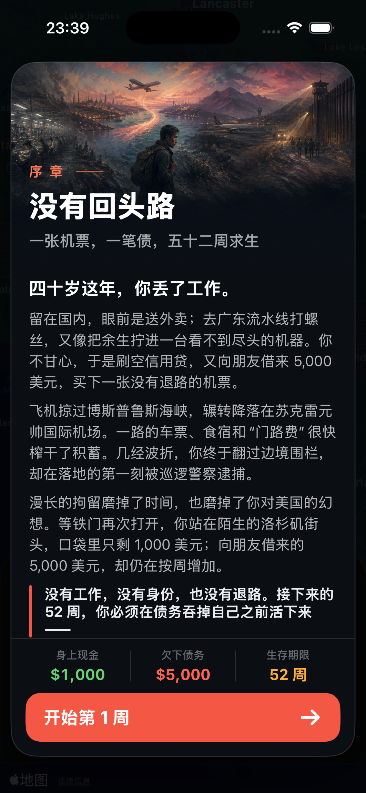
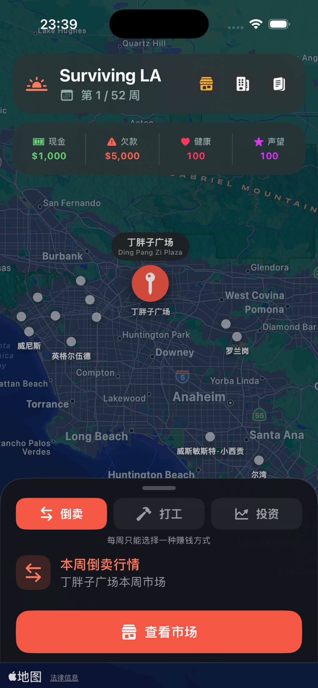
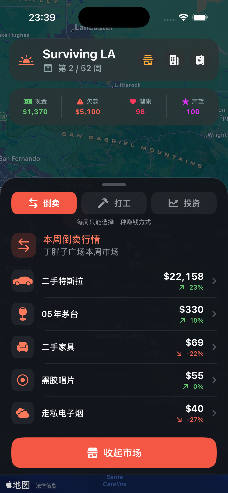

<p align="center">
  
</p>

<h1 align="center">Surviving LA · 洛杉矶浮生记</h1>

<p align="center"><strong>在一座不等你的城市里，给自己挣一个明天。</strong></p>

<p align="center">一款以洛杉矶为舞台的单人生存经营与交易策略游戏。<br>倒卖、打工、投资。在现金、欠款与健康之间，走完属于你的 52 周。</p>

<p align="center">
  <a href="#story">故事背景</a> ·
  <a href="#gameplay">核心玩法</a> ·
  <a href="#screenshots">游戏画面</a> ·
  <a href="#roadmap">1.1 开发计划</a> ·
  <a href="#inspiration">灵感与致谢</a> ·
  <a href="#development">项目与开发</a>
</p>

---

<a id="story"></a>

## 四十岁这年，你丢了工作。

你不甘心就这样过完一生。刷空信用贷，又向朋友借来 5,000 美元，你踏上一段辗转异国的旅程。车票、食宿和一路的波折耗尽积蓄；翻过边境围栏后，等待你的却是一段拘留生活。

等铁门再次打开，你站在陌生的洛杉矶街头。口袋里只剩 **1,000 美元**，那笔 **5,000 美元的欠款**，还在按周增加。

从丁胖子广场开始，你要在接下来的 **52 周**里找活干、找货卖、找机会。先还一点债，还是再进一批货？身体已经撑不住了，是去诊所，还是再熬一周？

**这一年的成绩，写在账本里，也写在你经历的每一件小事里。**

| 手上的本钱 | 身后的欠款 | 眼前的时间 |
| :---: | :---: | :---: |
| **$1,000** | **$5,000** | **52 周** |
| 每一笔进货都要算计 | 债务每周计息 2% | 每次选择都会让时间向前 |

<a id="gameplay"></a>

## 每周一次选择，三条谋生的路。

每周只能选择一种赚钱方式。你可以不断调整策略，但无法把所有机会都留在手里。

| 你的选择 | 怎么赚钱 | 要付出什么 |
| --- | --- | --- |
| **倒卖 · 靠眼光** | 观察不同地区的报价，低价买入，带着库存寻找下一处卖点。 | 库存容量有限，行情随周刷新；等一个好价格，欠款也会继续涨。 |
| **打工 · 靠力气** | 做一份当地的现金工作，赚取工资，也可能遇到小费或扣款。 | 工作会消耗健康，也会占用本周倒卖、投资的机会。 |
| **投资 · 靠判断** | 选择当地的短期项目，投入现金，当周结算盈亏。 | 风险越高，结果越难预料；一次亏损就可能打乱还债计划。 |

**看行情 → 选行动 → 结算这一周 → 面对新的局面。**

行动推进后，利息结算、市场刷新。倒卖途中还可能遇上地区随机事件。银行存取款、主动还债、诊所治疗和仓储升级，帮你安排下一步，也不占用每周的赚钱行动。

### 钱要周转，人也要撑住。

- **现金与债务**：留下进货的本钱，也别让利息吃掉利润。
- **库存与行情**：便宜的货值得买多少，取决于你还有多少空间、能等多久。
- **健康与收入**：打工能救急，身体却不是用不完的资源。健康归零，旅程就会提前结束。
- **选择与运气**：你能规划路线，却不能预先知道下一周的城市会发生什么。

## 十五个地点，十五种生活的切面。

从丁胖子广场的第一份差事，到韩国城的市场；从圣盖博谷的华人商圈，到威尼斯海边，再到橙县的小西贡。每个地点都有自己的商品价格倾向、工作、投资项目和地区故事。

在地图上移动，既是寻找价差，也是换一种谋生的可能。

<details>
<summary>展开完整的南加州地图地点</summary>

韩国城、帕萨迪纳·玫瑰碗、菲格罗亚走廊、好莱坞、银湖、英格尔伍德、卡尔弗城、西木区、威尼斯、圣塔莫尼卡、丁胖子广场、圣盖博、罗兰岗、尔湾、威斯敏斯特·小西贡。

查看[地点设计](docs/LOCATIONS.md)。

</details>

<a id="screenshots"></a>

## 你的故事，就在这张地图上发生。

<p align="center">
  <a href="docs/app-store/screenshots/iphone-6.5-upload/01-opening.jpg"></a>
  &nbsp;
  <a href="docs/app-store/screenshots/iphone-6.5-upload/02-map.jpg"></a>
  &nbsp;
  <a href="docs/app-store/screenshots/iphone-6.5-upload/03-market.jpg"></a>
</p>

<p align="center"><sub>iPhone 游戏界面截图：序章 · 城市地图 · 本周市场。界面以对应构建版本为准，点击可查看大图。</sub></p>

### 一座会打乱计划的城市

山火烟尘、酷热、堵在高速上的下午，或是餐馆后厨的一次意外，都可能改变你的安排。**56 条地区随机事件**与**7 个按周次和概率触发的世界事件**，让同一条路线也能走出不同的结果。

世界事件还会在一段时间内改变工资、行情、利息等规则。带油画插图的剧情弹窗，让一次数值变化成为你记得住的一段经历。

### 一局结束，一年的故事留下来

生存日记记下每周的行动与遭遇。旅程结束后，翻开年度账单，看看自己留下多少本钱、消耗多少健康、走过多少街区。历次旅程与本机最高成绩会被保存，重开之后仍能回看。

**洛杉矶没有第五十三周。你会带着什么，走到故事的最后？**

<a id="roadmap"></a>

## 接下来，1.1 想让你在洛杉矶过上怎样的生活？

**当前版本：1.0 · 下一步：1.1。** 我们正在规划五项更新，让每一周的谋生、每一次生活选择，都能影响接下来的旅程。

> 以下是 1.1 开发计划，尚未作为正式版本上线。具体数值与内容会根据开发和试玩调整，发布日期待定。计划更新于 2026 年 9 月 5 日。

| 计划更新 | 你将体验到什么 |
| --- | --- |
| **装备与生活配置** | 租房、租车、买车、考驾照。安排自己的生活条件，在健康、收入与持续支出之间寻找平衡。 |
| **声望改为运气** | 运气从 **50** 开始。做好事增加运气，做坏事减少运气；运气越高越容易遇到好事，越低越容易遇到坏事。 |
| **人生选择事件** | 在 52 周旅程的不同阶段，遇到 Paradox 式随机两难问题。你的决定会增加或减少运气与健康，留下不同的人生经历。 |
| **每个地点 2–3 个工种** | 同一个街区也有不同谋生方式。比较工资、体力消耗与工作要求，选择适合当前处境的活。 |
| **所有事件与地点配图** | 为全部地点、已有事件及 1.1 新事件补齐图片素材，延续统一的油画风格，让每处街区、每段遭遇都有对应画面。 |

计划先打通运气、装备和多工种，再完善分阶段人生事件；图片素材同步分批补齐，最后进行整体平衡与真机试玩。

想看具体规则、开发阶段与完成标准，可以阅读 **[1.1 完整开发路线图](docs/ROADMAP-1.1.md)**。欢迎 Star 关注进展，或通过 [Issue](https://github.com/graymongooseus/SurviveInLA-ios/issues) 告诉我们你最期待的玩法。

<a id="inspiration"></a>

## 从《北京浮生记》得到灵感，在洛杉矶写下新的故事。

《北京浮生记》启发了这个项目：带着有限的本钱与欠款，在城市中奔走，靠交易和选择谋生，同时面对不可预料的生活事件。我们想延续的，是那种“小人物与大城市周旋”的紧张感。

**Surviving LA 的 iOS 游戏代码由 Swift / SwiftUI 独立编写，没有使用、复制或移植《北京浮生记》的源代码。** 这份灵感被带进了新的洛杉矶故事、52 周旅程，以及围绕倒卖、打工、投资展开的玩法中。

本仓库保留了一份[《北京浮生记》v1.2.2 历史归档](archive/beijing-fusheng-v1.2.2/)，用于项目历史与玩法研究。归档中的 Windows/MFC 源码、可执行文件和资源与 iOS 工程分离，不参与 App 的编译、链接或打包。归档继续适用其原有的 [GPL-2.0 许可](archive/beijing-fusheng-v1.2.2/license.txt)；独立 iOS 实现的许可边界见[说明文档](docs/LICENSING.md)。

感谢《北京浮生记》带来的启发。

<a id="development"></a>

## 项目与开发

本页展示开发中的 **Surviving LA**。项目以 iPhone 为目标，使用 **SwiftUI + MapKit** 构建原生界面，以纯 Swift 实现核心规则。公开下载入口将在发布后补充。

想关注后续进展，可以 **Star 本仓库**；遇到问题或有玩法建议，欢迎[提交 Issue](https://github.com/graymongooseus/SurviveInLA-ios/issues)。

<details>
<summary><strong>构建与运行</strong></summary>

1. 使用 Xcode 26 或兼容版本打开 `SurviveInLA.xcodeproj`。
2. 选择 iPhone 模拟器或已配置签名的 iPhone。
3. 运行 `SurviveInLA` scheme。

当前本地候选版本最低目标为 iOS 18，仅适配 iPhone；核心 App 没有第三方依赖，不需要获取玩家的实时位置。构建设置以检出的代码版本为准。

```text
SurviveInLA/
├── App/          # App 入口
├── Domain/       # 游戏状态与内容定义
├── Engine/       # 纯 Swift 游戏规则
├── Store/        # UI 状态协调
├── UI/           # SwiftUI 页面和组件
└── Resources/    # iOS 资源
SurviveInLATests/ # 核心规则测试
docs/            # 架构、机制、发布资料与设计
archive/         # 独立保存的历史参考资料
```

</details>

<details>
<summary><strong>设计、开发与发布文档</strong></summary>

- [游戏机制](docs/GAME-DESIGN.md) · [地点设计](docs/LOCATIONS.md)
- [洛杉矶随机事件](docs/LOS-ANGELES-EVENTS.md) · [世界事件表](docs/WORLD-EVENTS.md)
- [终局故事与结算（含剧透）](docs/ENDING.md)
- [系统架构](docs/ARCHITECTURE.md) · [1.1 开发路线图](docs/ROADMAP-1.1.md) · [历史路线图](docs/ROADMAP.md)
- [App Store 发布清单](docs/APP-STORE-RELEASE-CHECKLIST.md)
- [许可边界](docs/LICENSING.md)

世界榜交互与服务器部署仍在开发中，对应工作文件为 `docs/WORLD-LEADERBOARD.md` 和 `server/leaderboard/README.md`；当前游戏成绩展示为本机排行榜。

</details>

---

<p align="center"><a href="docs/PRIVACY.md">隐私政策</a> · <a href="docs/SUPPORT.md">用户支持</a> · <a href="https://github.com/graymongooseus/SurviveInLA-ios/issues">反馈建议</a></p>

<p align="center"><sub>游戏中的人物、商品、货币与事件均为虚构。除另有说明外，独立 iOS 实现保留所有权利；历史归档适用其自身许可。</sub></p>
