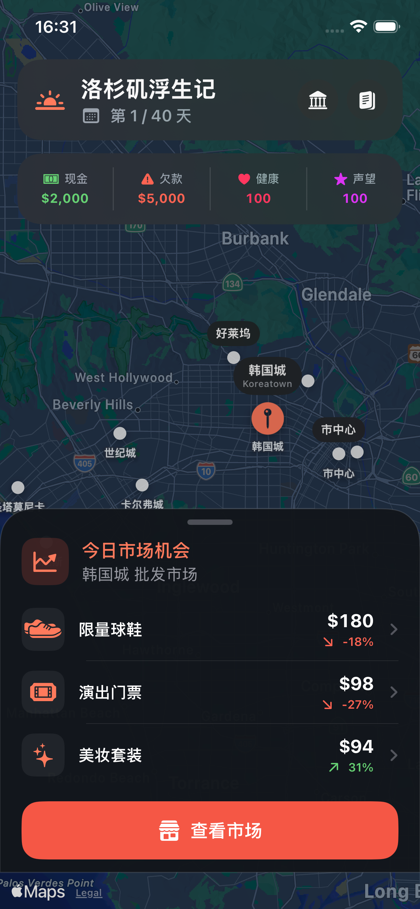

# 洛杉矶浮生记 · Survive in LA

《北京浮生记》的原生 iOS 重制项目。新版本使用 SwiftUI + MapKit，将经典的“移动、交易、负债、随机事件”循环改造成适合单手操作的现代 iPhone 游戏。

## 当前状态

`0.2` 可玩 iOS 基础版已经包含：

- 地图优先的主界面
- 15 个大洛杉矶区域，使用稳定 ID 和中英文地名
- 每日市场和五种随机商品报价
- 买入、卖出、库存容量与平均成本
- 52 周旅程、债务与存款利息
- 52 条分地区随机事件（市场 23、健康 17、钱财 12）
- 银行存取款、主动还债、诊所治疗和仓储升级
- 生存日记、健康失败、最终库存清算和重新开始
- 可复现的随机数与核心规则测试

当前旅行地点为：韩国城、帕萨迪纳·玫瑰碗、菲格罗亚走廊、好莱坞、银湖、英格尔伍德、卡尔弗城、西木区、威尼斯、圣塔莫尼卡、丁胖子广场、圣盖博、罗兰岗、尔湾和威斯敏斯特·小西贡。十五个地点分别拥有商品价格倾向、工作、投资和合理的地区事件；完整定位见 [地点设计](docs/LOCATIONS.md)，完整事件表见 [洛杉矶随机事件](docs/LOS-ANGELES-EVENTS.md)。

## 运行

1. 使用 Xcode 26 或兼容版本打开 `SurviveInLA.xcodeproj`。
2. 选择任意 iPhone 模拟器。
3. 运行 `SurviveInLA` scheme。

最低目标为 iOS 17。项目目前没有第三方依赖，也不需要定位权限或网络服务。

## 新版目录

```text
SurviveInLA/
├── App/          # App 入口
├── Domain/       # 游戏状态与内容定义
├── Engine/       # 纯 Swift 游戏规则
├── Store/        # UI 状态协调
├── UI/           # SwiftUI 页面和组件
└── Resources/    # iOS 资源
SurviveInLATests/ # 核心规则测试
docs/             # 架构、机制和路线图
archive/          # 原版《北京浮生记》历史工程
```

原版《北京浮生记》v1.2.2 的 Windows/MFC 源码、可执行文件和资源已统一归档至 [`archive/beijing-fusheng-v1.2.2/`](archive/beijing-fusheng-v1.2.2/)，仅作为规则与项目历史参考。

## 当前界面



## 设计与开发文档

- [系统架构](docs/ARCHITECTURE.md)
- [游戏机制](docs/GAME-DESIGN.md)
- [开发路线图](docs/ROADMAP.md)
- [App Store 发布清单](docs/APP-STORE-RELEASE-CHECKLIST.md)
- [隐私政策](docs/PRIVACY.md)
- [用户支持](docs/SUPPORT.md)

## 许可

本项目从《北京浮生记》GPL-2.0 源码派生，继续遵守原工程的 [`license.txt`](archive/beijing-fusheng-v1.2.2/license.txt)。发布或分发衍生版本时，需要同时满足 GPL-2.0 对应源码和许可声明要求。
