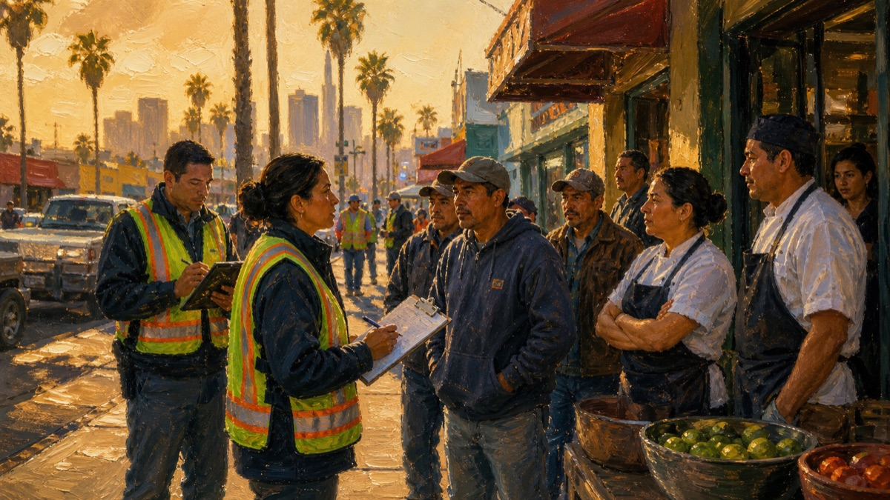
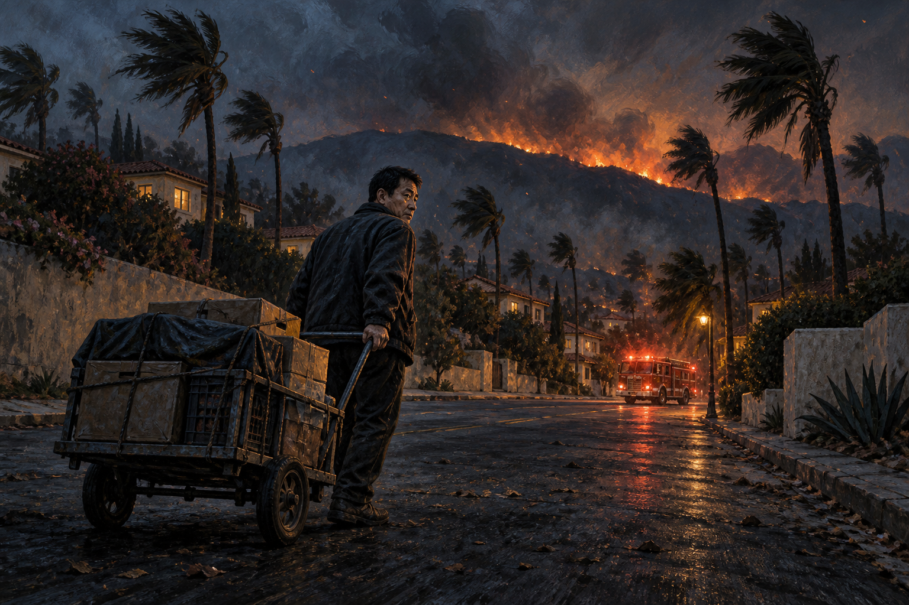

# 世界事件表

内容版本：2026.09.09.2。共 8 个世界事件。

## 触发与概率

第 5、9、13……49 周各检查一次，有合格候选时必定抽取一个。现有 8 个事件没有额外地点、职业、资产或日期条件；同一事件持续期间被排除，到期后可以再次抽取。不同事件可同时生效，通知关闭不移除增益。

所有基础权重为 1。权重 = 3 ^ (方向 × 强度 × (当前运气 − 50) / 50)，方向为有利 +1、混合 0、不利 −1，实际概率为候选内权重占比。运气包含临时增益并限制在 0～100。运气 50 且所有事件都合格时，每个事件概率为 12.5%。

## 当前效果

百分比表示相对于原值的倍率变化，不是百分点或一次性奖励。— 表示无调整。

| 世界事件 | 持续 | 卖货收入 | 打工 | 存款利息 | 投资盈亏 | 债务利息 | 健康变化幅度 | 商品报价 |
|---|---:|---:|---:|---:|---|---:|---:|---:|
| 员工举报，洛杉矶突查餐馆欠薪 | 4 周 | -20% | +20% | +5% | -5% | -5% | -10% | — |
| 洛杉矶、长滩双港大堵船 | 5 周 | -45% | +10% | -10% | -20% | +15% | +20% | — |
| 奥斯卡颁奖周，游客挤满洛城 | 6 周 | +50% | +12% | +10% | +20% | +10% | -10% | — |
| 洛杉矶房贷利率飙升 | 8 周 | -30% | -5% | +60% | -25% | +55% | +10% | — |
| 海峡断航，洛杉矶油价暴涨 | 3 周 | -25% | — | — | 随机回报上限 −35% | — | — | +55% |
| 帕萨迪纳玫瑰花车游行开幕 | 5 周 | +65% | +25% | +8% | +15% | +5% | +10% | — |
| 洛县流感暴发，商圈客流骤减 | 6 周 | -40% | -28% | -5% | -30% | +8% | +50% | — |
| 洛杉矶山火蔓延，市集紧急停摆 | 4 周 | -50% | -20% | — | -15% | — | +30% | +20% |

卖货倍率作用于卖出总收入及终局库存清仓，不修改报价或买入成本。海峡危机和山火另外配置了商品报价倍率。多个活动事件的同类倍率相乘；普通投资回报上限取最严格值，之后缩放盈亏。普通投资的正负盈亏都会被倍率缩放，FF 延迟投资独立结算。健康倍率同时缩放接入它的恢复与损失，不等于直接增加健康；按摩和个人逐回合恢复独立结算。利息修正只作用于每周利息，原有本金不直接改变。

旧存档已激活事件保存当次倍率，继续沿用原数值；新触发事件使用这次调整后的数值。

## 图片与文字

标题、描述由原生世界事件弹窗显示，图片通过 imageName 自动加载。奥斯卡、玫瑰花车和山火使用本次新图；其余 5 张沿用已核对的现有插图。原有泛消费和圣诞节图片保留在资产目录中，但不再用于这两个世界事件。

### 员工举报，洛杉矶突查餐馆欠薪

一名后厨员工拿着工资记录举报欠薪，洛杉矶的餐馆接连迎来劳工检查。老板们忙着补工资、理账本，临工报酬有所上涨；熟客却捂紧钱包，你手里的货也更难卖出好价。

ID：`labor-enforcement-wave`；资源：`WorldLaborEnforcement`。

### 洛杉矶、长滩双港大堵船

洛杉矶港和长滩港外，等泊位的货轮排起长队，710 高速上的货柜车挪得比人走还慢。仓库急着找人搬货，但交货延误、买家压价，原本谈好的生意也接连缩水。

ID：`port-logistics-gridlock`；资源：`WorldPortGridlock`。

### 奥斯卡颁奖周，游客挤满洛城

奥斯卡颁奖周到了，杜比剧院外铺起红毯，好莱坞大道挤满举着手机的游客。相机、纪念品和临时差事都有人问，你的摊位忽然忙了起来，卖货进账明显增加。

ID：`southern-california-spending-boom`；资源：`WorldOscarsWeek`。

### 洛杉矶房贷利率飙升

贷款经纪人的新报价让洛杉矶买房群安静了下来，月供越算越高。大家开始推迟大额消费、砍价更狠，你手里的货周转变慢；银行存款利息增加，欠款利息却涨得更快。

ID：`rapid-rate-hike`；资源：`WorldRateHike`。

### 海峡断航，洛杉矶油价暴涨

霍尔木兹海峡传来断航消息，洛杉矶加油站前排起长队，送货司机纷纷加收运费。市场商品报价上涨，买家却捂紧钱包、不断压价；你的卖货收入受到打折，普通投资也被恐慌抛售拖入亏损。

ID：`strait-of-hormuz-crisis`；资源：`WorldHormuzCrisis`。

### 帕萨迪纳玫瑰花车游行开幕

帕萨迪纳的科罗拉多大道摆满折叠椅，巨大的玫瑰花车缓缓驶过人群。来看游行的家庭挤满沿街店铺，零食和随手买的小物件格外好卖；你忙着补货收钱，连坐下吃饭的空当都没有。

ID：`holiday-economy-surge`；资源：`WorldRoseParade`。

### 洛县流感暴发，商圈客流骤减

洛县流感蔓延，韩国城和圣盖博的店门口贴起临时缩短营业时间的通知。熟客取消聚餐，老板减少排班，空荡荡的商圈让货越来越难出手，身体状态的起伏也比平时更明显。

ID：`regional-public-health-crisis`；资源：`WorldHealthCrisis`。

### 洛杉矶山火蔓延，市集紧急停摆

圣安娜风卷着火星越过洛杉矶山坡，撤离警报响个不停，灰烬落在你的货箱上。道路封闭、露天市集取消，熟客忙着收拾行李。临工减少，卖货收入腰斩，运输受阻还推高了市场商品报价。

ID：`los-angeles-wildfire`；资源：`WorldLAWildfire`。

## 验证

在本机完整的内容/代码副本运行校验，图片引用指向项目真实资产：78 条事件、258 条文字引用及素材检查通过。Swift 核心测试共 149 项，147 项通过，2 项按既有规则跳过（iOS 专用图片测试与在线排行榜上传测试），0 失败。新增测试覆盖山火与旅游事件叠加、独立过期，以及山火对终局清仓的影响。已检查三张生成图片的主体与横向裁切安全区；本次未重新运行 iOS 模拟器整包。

新图片使用内置 image_gen 生成，完整提示词见 [image-prompts.json](design/world-events/image-prompts.json)。
