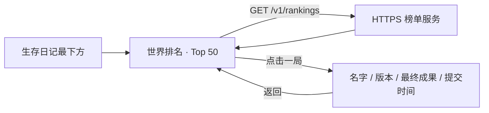

# 世界排名 · Top 50

## 已实现

游戏「生存日记」列表最下方新增「世界排名」。点击后在当前导航栈打开排名页，按每一份已提交的通关存档排序，最多显示 50 条；同一玩家的不同通关可分别上榜。

公网 API：`https://2.24.206.66:18443/v1/rankings?limit=50`。无需登录即可查看，查询只发 GET，不读取、不上传本机存档或历史成绩。

## 玩家交互

1. 生存日记滚动到底部，点击「世界排名」。
2. 页面打开时刷新服务器数据，显示玩家人数、提交存档数及更新时间。
3. 每行显示名次、提交昵称、最终净资产、Profile 槽位、提交的游戏版本、剩余健康、事件种数及充值标记。
4. 点击条目进入「通关成果」，查看这局的成绩摘要、游戏版本、通关时间和服务器收到记录的时间。
5. 顶部返回回到榜单/日记；刷新按钮或下拉可重新获取排名。

## 排名与字段

- 每条记录是一局，不以玩家合并为最高分。本机记录仍保留原来的 Profile 排名与日记。
- 按最终净资产从高到低；相同成绩按服务器首次收到的顺序排列。
- 少于 50 条时只展示实际记录，不补充虚构用户。
- 名字为服务器保存的公开昵称，不自动读取 Apple 真实姓名。
- `app_version` 来自这局提交的版本，不能替换成正在查看榜单的 App 版本。
- 最终成果包括 `net_worth`、`health`、`experience_count`、`used_purchases`。详情显示 `completed_at` 与 `received_at`，不展示完整存档、个人 Apple 标识或日记内容。
- 第一版信任提交的分数；充值成绩一起排名并标注「含充值」。
- `/v1/leaderboard` 原来的玩家最高分接口继续保留兼容，新日记页面使用 `/v1/rankings`。

## 加载、失败与空状态

- 首次加载显示「正在读取世界排名…」。
- 无记录显示「还没有提交的通关成绩」。
- 首次请求失败提供「重新加载」；刷新失败保留该页面此前成功获取的内容，并提示它是上次读取的排名。
- 更新时间来自最近一次成功响应，不因重试失败改变。
- 离开页面取消加载时不显示错误；不持续轮询，不影响游戏移动或交易。
- 当前缓存只存在于页面状态中，没有写入磁盘的离线榜单。

## 本次接入文件

| 文件 | 作用 |
|---|---|
| `UI/Home/SupportViews.swift` | 日记最后一个 Section 的世界排名入口 |
| `Store/WorldRankingStore.swift` | 排名读取、终局负载、持久化上传队列及网络恢复重试 |
| `UI/Home/WorldRankingView.swift` | 排名列表、单局详情、昵称设置、上传状态 |
| `SurviveInLATests/WorldRankingTests.swift` | 版本/时间解码、只读请求及失败状态测试 |
| `server/leaderboard/app.py` | Top 50 单局排序与版本/提交时间字段 |

## 服务器

VPS `2.24.206.66`：API 容器监听本机 18080，Caddy 对外监听 HTTPS 18443，使用公开受信任的 IP 证书并自动续期。Nginx 的独立 IP 站点仅把 HTTP-01 验证路径转发至本机 18081，原有网站的 80/443 配置保留。数据保存在独立 SQLite volume。

详见 [部署记录](../server/leaderboard/DEPLOYMENT.md) 和 [服务说明](../server/leaderboard/README.md)。

## 测试版上传（已接入）

每次通关只上传当前通关存档的本局实际成绩。一次 POST 一个对象，不扫描其他 Profile 或历史记录，不以历史最高分替代；同一玩家的较低分通关也独立提交。

- 玩家身份：本机持久化随机测试 ID + 可修改昵称，不依赖 CloudKit 配置、不读取 Apple 账户名字。可在「生存日记 → 世界排名」修改昵称；跨设备不合并身份。
- 自动提交：本版中正在进行的局首次进入 52 周终局时，在重开前将不可变成绩持久化至 `Application Support/SurviveInLA/ranking-uploads-v1.json`，再通过 HTTPS 上传。终局 ID 取首条抵达日记的 UUID。重开或删除槽位不丢失已入队成绩。
- 已有通关：打开已完成的存档不会自动扫入；结算页提供「上传本局成绩」，只提交当前打开的一局。
- 重试：联网恢复、App 启动/回到前台、结算页重试或世界排名页重试，只处理队列已有记录。重试保留初次入队的成绩、版本、日期和 run ID。
- 昵称：默认「洛城旅人 + 随机后缀」，修改后通过 `PUT /v1/player` 同步；服务端不会把昵称当唯一 ID。
- 成功：201 新记录或 200 相同 run ID 的幂等回执，且回执 ID 一致才显示已上传。断网/5xx 保留等待状态；409 等客户端错误保留记录并显示错误码，不无限重发。上传队列损坏时不会静默覆盖或重建身份。
- 结算页显示当局上传状态、实际净资产及世界排名入口；排行榜能查看待上传数量并重试。完整日记与全量游戏存档仅保留在原有本机/iCloud 保存流程。
- 通关资格：52 周且健康大于零；支持 `deported`（单程广州）和 `rooted`（生根洛杉矶）。提前健康归零的局不上世界通关榜。

首次测试榜仍使用 `la-52w-v1`，明确扩展为同时支持两种结局。扩展前公网榜无玩家记录，仅有已清理的开发验证样本，因此没有混入旧版本真实成绩。数据库迁移到版本 2，为旧记录补 `ending=deported`，保留原有去重指纹。正式发行后如果改变比较规则，应单独升级 ruleset。

## 验证

服务端 17 项测试覆盖 Top 50、单局保存、幂等、昵称、可信分数、两种结局和数据库迁移。客户端测试覆盖实际净资产/版本构造、通关资格、当前存档自动提交、历史档隔离、断网恢复、重复回执、冲突、错误回执、损坏队列与昵称校验。

可选公网联调测试：运行 `RankingUploadTests/testLiveCompletionUploadAndPublicRankingWhenEnabled`，显式设置 `TEST_RUNNER_LEADERBOARD_LIVE_TEST=1`。它在独立临时目录生成「Codex上传联调临时」玩家，通过原生完成存档流程提交两局，再经公开 HTTPS 榜单验证两笔原分数。测试运行后需按输出的随机玩家 ID 清理该测试玩家；默认测试不会写公网。

本次已执行原生公网联调并通过，两条临时记录验证后清理。新增 UI 已编译；本次交互截图验收因 Mac 锁屏无法执行，未声明完成点击验收。
